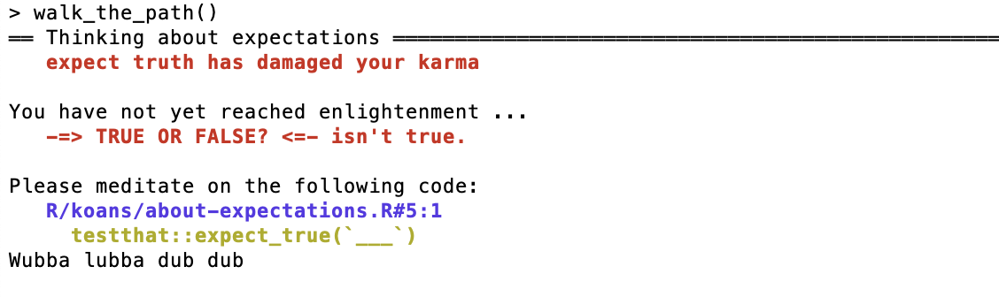

# advRkoans
<!-- badges: start -->
[](https://zenodo.org/badge/latestdoi/239526103)
[](https://github.com/pgcudahy/advRkoans/actions)
<!-- badges: end -->
advRkoans is an interactive tutorial for learning advanced R programming by making tests pass. 
Following the lessons from Hadley Wickham's [Advanced R](https://adv-r.hadley.nz/). 
Format inspired by Greg Malcom's [Python Koans](https://github.com/gregmalcolm/python_koans), 
which are in turn inspired by Edgecase's [Ruby Koans](http://rubykoans.com/).



## Getting started
```
pgcudahy$ R
> devtools::install_github("pgcudahy/advRkoans")
> library(advRkoans)
> walk_the_path()
══ Thinking about expectations ═════════════════════════════════════════════════
   expect truth has damaged your karma

You have not yet reached enlightenment ...
   -=> TRUE OR FALSE? <=- isn't true.

Please meditate on the following code:
   koans/about-expectations.R#5:1
     testthat::expect_true(`___`)
Wubba lubba dub dub

> 
```
Most tests are fixed by opening the file with the test error in a text editor
and filling in the missing parts of `expect` functions. Eg:
```
    testthat::expect_equal(`__`, 1+2)
```
which can be fixed by replacing the \`__\` part with the appropriate code:
```
    testthat::expect_equal(3, 1+2))
```
